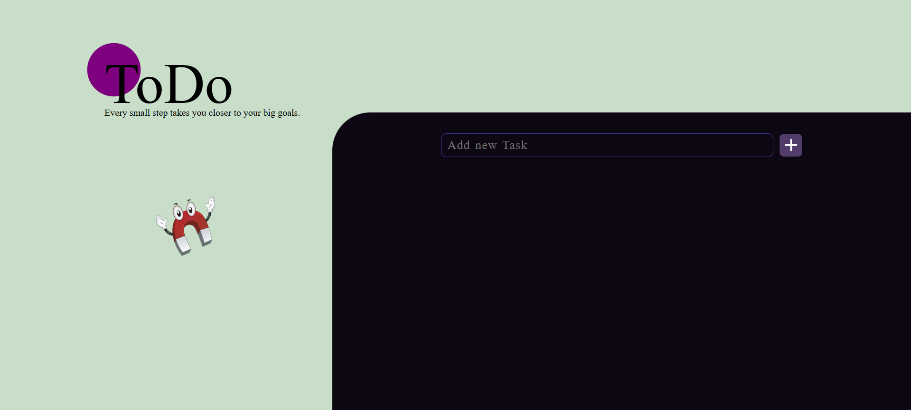
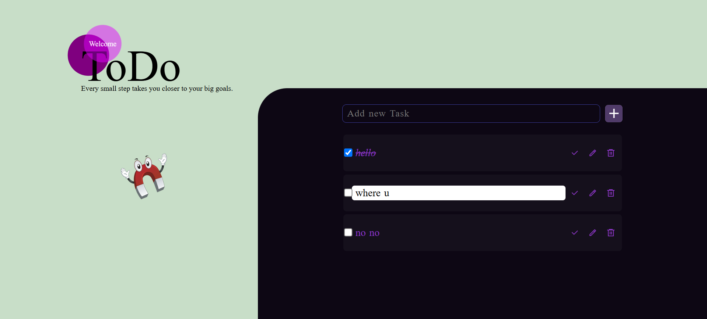

# To-Do List Webpage

## Description

A simple To-Do list webpage that allows users to add, edit,mark tasks as done and delete tasks. The application uses HTML, CSS, and JavaScript to provide a dynamic and interactive user experience.

## Screenshots

### Home Page


### Task Editing


## Features

- **Add Tasks**: Users can add new tasks to the list.
- **Edit Tasks**: Users can edit existing tasks.
- **Mark Tasks as Done**: Users can mark tasks as completed.
- **Delete Tasks**: Users can remove tasks from the list.
- **Responsive Design**: The page is designed to be responsive and works on various screen sizes.

  
## Project Structure
```
/project-root
├── index.html              # Main HTML file
├── assets                  # Directory containing image assets
│   ├── check-line (1).svg
│   ├── pencil.svg
│   ├── delete.svg
│   ├── add-fill.svg
│   ├── Location_dot_purple.webp
│   ├── pngegg.png
│   └── screenshots         # for README File
├── styles.css              # CSS file for main styling
├── responsive.css          # CSS file for responsive design
└── script.js               # JavaScript file for functionality
```

## Technologies Used

- **HTML**: Markup language used for the webpage structure.
- **CSS**: Styling language used for layout and design.
- **JavaScript**: Programming language used for interactive features.
